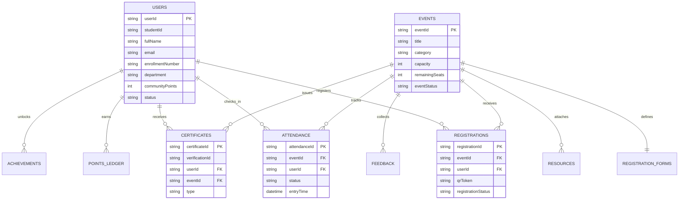

# MCC Platform — Entity Relationship Diagram (ERD)

```mermaid
erDiagram
    USERS ||--o{ REGISTRATIONS : registers
    USERS ||--o{ ATTENDANCE : checks_in
    USERS ||--o{ CERTIFICATES : receives
    USERS ||--o{ POINTS_LEDGER : earns
    USERS ||--o{ ACHIEVEMENTS : unlocks
    
    EVENTS ||--|| REGISTRATION_FORMS : defines
    EVENTS ||--o{ REGISTRATIONS : receives
    EVENTS ||--o{ ATTENDANCE : tracks
    EVENTS ||--o{ RESOURCES : attaches
    EVENTS ||--o{ FEEDBACK : collects
    EVENTS ||--o{ CERTIFICATES : issues

    USERS {
        string userId PK
        string studentId
        string fullName
        string email
        string enrollmentNumber
        string department
        int communityPoints
        string status
    }

    EVENTS {
        string eventId PK
        string title
        string category
        int capacity
        int remainingSeats
        string eventStatus
    }

    REGISTRATIONS {
        string registrationId PK
        string eventId FK
        string userId FK
        string qrToken
        string registrationStatus
    }

    ATTENDANCE {
        string attendanceId PK
        string eventId FK
        string userId FK
        string status
        datetime entryTime
    }

    CERTIFICATES {
        string certificateId PK
        string verificationId
        string userId FK
        string eventId FK
        string type
    }
```
